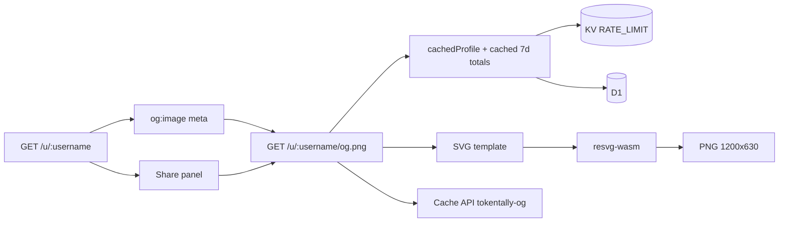

# Profile Share Card — Design

Date: 2026-07-19  
Status: approved for planning  
Stack: Hono on Cloudflare Workers + D1 + KV (`RATE_LIMIT`) + Cache API

## Goal

Give each public profile a **dynamic social share card**:

1. Open Graph / Twitter large-image preview when `/u/:username` is pasted into social apps
2. On-profile share UI: preview, copy link, download PNG, and native Share when available

## Decisions

| Topic          | Choice                                                                                                                       |
| -------------- | ---------------------------------------------------------------------------------------------------------------------------- |
| Scope          | Dynamic OG image **and** on-page share UI                                                                                    |
| Card layout    | Poster flex (monochrome dark canvas)                                                                                         |
| Card stats     | Last 7 days + All time; each: tokens, est. cost, sessions; plus username + rank + brand                                      |
| Image pipeline | Hand-authored SVG template → PNG via `resvg-wasm` on the Worker                                                              |
| Size           | 1200×630 (`summary_large_image`)                                                                                             |
| Data cache     | Existing KV `cachedProfile` / `getOrSet` + `READ_CACHE_TTL_SECONDS` (600); invalidate via `invalidateProfileCache` on ingest |
| HTTP cache     | Same pattern as `pageCache` / `apiCache`: Hono Cache API middleware, `max-age=600`, cache name `tokentally-og`               |
| Share actions  | Copy link, Download PNG, `navigator.share` when supported                                                                    |
| Out of scope   | Square/story variant, per-network share buttons, custom themes, active Cache API purge beyond TTL                            |

## Architecture

### Image route

- **Path:** `GET /u/:username/og.png`
- **Middleware:** Cache API wrapper matching [`src/lib/page-cache.ts`](../../../src/lib/page-cache.ts) — `cacheName: 'tokentally-og'`, `Cache-Control: public, max-age=${READ_CACHE_TTL_SECONDS}`. No `Vary` on Accept/Origin (URL is the cache key).
- **Handler:**
    1. Load all-time profile via `cachedProfile(db, kv, username)`
    2. Load last-7-day totals via a new cached helper (same TTL / key namespace as aggregates, e.g. `agg:profile7d:v1:{username}`)
    3. If profile missing → `404` (do not store in KV; do not rely on caching error bodies)
    4. Build SVG from Poster-flex template; escape text for XML
    5. Rasterize with `resvg-wasm`; return `image/png`

### Data

Extend aggregate reads so the card can show 7-day windows without changing the public profile JSON shape unless useful elsewhere:

- **All time:** existing `Profile` (`grand_total`, `cost`, `sessions`, `rank`, `username`)
- **Last 7 days:** `grand_total`, `cost`, `sessions` for `window: '7d'` scoped to that user (reuse `windowStart('7d', now)` and the same synthetic-model filter as leaderboard/profile)

Format numbers with existing `formatTokens` / `formatUsd` so the card matches on-site formatting.

Ingest / history already call `invalidateProfileCache`; also invalidate the 7d key in that same helper so both aggregates refresh together.

### HTML meta

Extend [`Layout`](../../../src/pages/layout.tsx) with optional overrides:

- `ogImage` (default remains `{origin}/og.png`)
- `ogUrl` (default origin / current page URL for profiles)
- `description` (profile-specific one-liner when useful)

Profile page sets:

- `og:image` / `twitter:image` → `{origin}/u/{username}/og.png`
- `og:image:width` / `height` → 1200 / 630
- `og:url` → `{origin}/u/{username}`

### On-page share UI

On [`ProfilePage`](../../../src/pages/profile.tsx), under the hero and before the main stat grid:

- Preview `` in a simple 16:9 frame (site chrome, not a heavy card)
- **Copy link** — clipboard write of the absolute profile URL; brief “Copied” feedback
- **Download** — fetch PNG and save as `{username}-tokenmaxer.png`
- **Share…** — `navigator.share({ title, text, url, files? })` when available; omit the control otherwise
- Small progressive-enhancement script scoped to the profile page; preview + download link remain usable without JS where possible

## Card visual (Poster flex)

- Canvas `#0A0A0A`
- Top row: Capsule Ladder mark + `tokenmaxer.quest` wordmark; rank pill (`Rank #{n}`)
- Hero: username (large display tracking)
- Stats block under the name (not footer-stuck): two columns
    - **Last 7 days** — Tokens · Est. cost · Sessions
    - **All time** — Tokens · Est. cost · Sessions
- System fonts in SVG suitable for `resvg` (Helvetica Neue / Arial stack, matching existing static `brand/logo/og.svg`)

## Caching policy

Align with dashboard read cache ([#11](https://github.com/jackmcpickle/tokentally/commit/3953ba1)):

| Layer          | Mechanism                | TTL                      | Invalidation                                                |
| -------------- | ------------------------ | ------------------------ | ----------------------------------------------------------- |
| Aggregate JSON | KV `getOrSet`            | 600s                     | `invalidateProfileCache` on ingest/history (include 7d key) |
| PNG bytes      | Hono `cache()` Cache API | 600s via `Cache-Control` | TTL only (same as HTML pages)                               |

Do not introduce a shorter OG-only TTL.

## Testing

- OG route: known user → `200`, `Content-Type: image/png`, `Cache-Control` includes `max-age=600`
- OG route: unknown user → `404`
- Username XML escaping in SVG builder
- Unit tests for card payload / formatting from profile + 7d totals (no WASM required)
- Profile HTML includes `og:image` pointing at `/u/{username}/og.png`
- `invalidateProfileCache` clears both all-time and 7d keys

## Non-goals

- Square OG / Stories formats
- Client-side canvas redraw as a second image source
- Satori / React-based layout
- Per-network share buttons (Twitter/X, LinkedIn, etc.) beyond Web Share API
